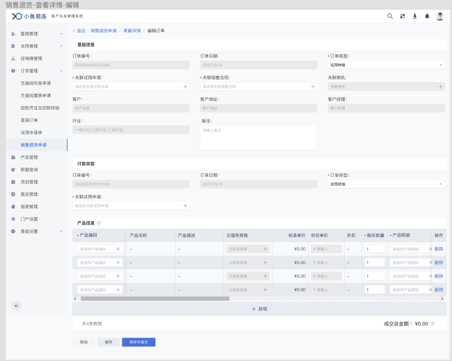
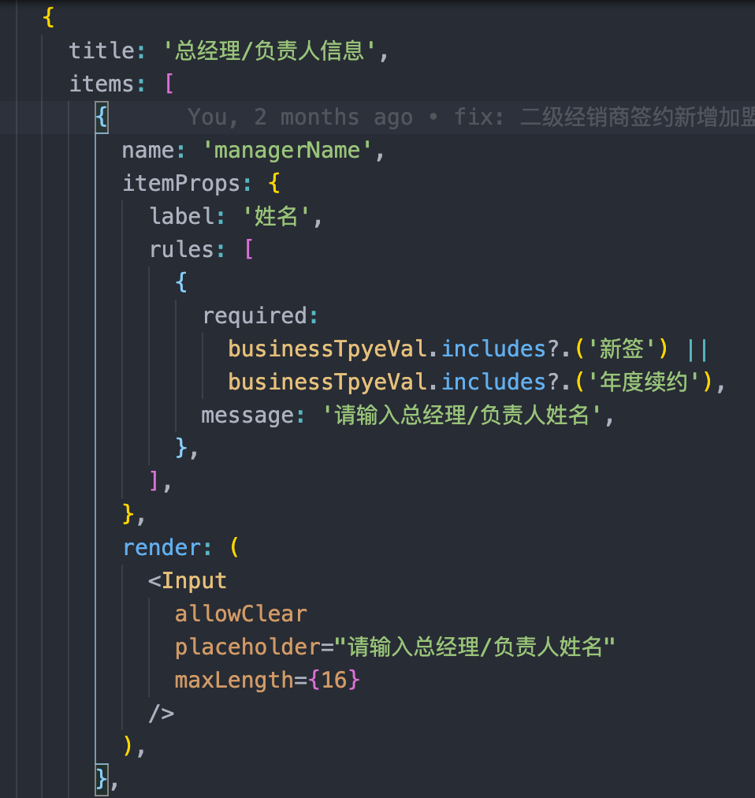
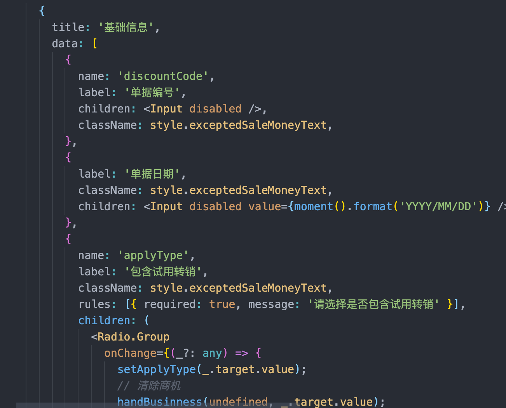
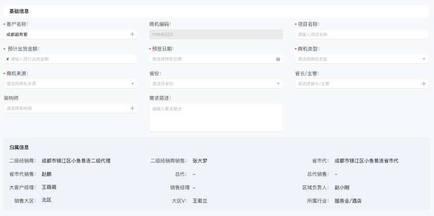

# 新建模块
  一级内容：展示新建单据的表单项，包含输入框，选择框、日期、产品选择等
  二级内容：提交，保存，开通后台，文件上传等抽屉，弹窗
  新建&编辑共用一套UI

## 现状分析
  目前不同模块采用不同设计方式，大致可以分为以下几类：
  1. 基于组件 `import FormItem from '@/components/formItemThreeRows'` 生成一行3列布局的 FormItem 块，顶部面包屑，产品选择，弹窗、抽屉等均为单独组件，整体布局未统一
  系统使用此方式的模块：
    客户报备、客户列表，待分配客户（共用客户列表新建）
    商机管理
    常规试用转准销售
    试用申请
    合同申请
    二级经销商出货报备
    产品折扣申请单
    销售机转样机
    退货申请单
    充值码作废申请单
    充值码置换申请单

  2. 基于 `import FormEditSlot from '@/components/formEditSlot'` 生成的整个新建&编辑页面，二级内容：弹窗、抽屉等使用单独组件
  系统使用此方式的模块：
    试用归还
    直销订单
    开票申请
    二级经销商签约
    预付款增补单
    总代订单
    销货管理
    总代样机订单
    样机转销售机
    设备调换申请单
    设备翻新
    业绩核定

   
  1. 依赖 antd From.Item 实现，需要改造
  模块
    回款核销
    一级经销商签约


## 新版设计图
  

## 设计思路
  鉴于以上分析，CRM系统中常用有两种实现方式，formEditSlot的实现方式功能相对完善，formItemThreeRows只实现了基础布局。但新建&编辑逻辑较多，直接全部使用formEditSlot重构时间成本太大，所以打算采用向前兼容的方式改造。基于formEditSlot完善组件功能，布局引用 formItemThreeRows 组件实现，提供配置转化方法，先按设计图修改通用样式，然后采用逐步替换方式替换所有模块。

  formEditSLot组件的模版配置
  

  formItemThreeRows的模版配置
   

  转换方法设计

  将formProps的传入数据进行格式化处理，再传入formItemThreeRows组件

  可补充功能：内置保存，保存并提交，开通企业后台等通用二级弹窗

## 组件详细设计
  > 需求背景： CRM系统中新建&编辑单据
  - UI
    1. 面包屑（无，自定义，默认：返回/单据名称/新建订单 & 返回/单据名称/查看详情/编辑单据）（注意：统一路由配置）
    
    面包屑props设计
        ```ts
        /** @desc 面包屑数据，传 false 隐藏，传配置则覆盖默认，默认从路由取值 */
        navData?:  false | BreadCrumbItem[] ;
        ```
    1. 信息块
      - 2.1. 常规：标题 + 表单（默认一行3列，左对齐）
      
      - 2.2. 特殊：前后有额外信息 + 标题 + 表单（默认一行3列，左对齐）
      
      section信息块的props设计 
        ```ts
        export interface SectionProps {
          /** @desc Section key 默认取 index */
          key?: React.Key;
          /** @desc section 标题 */
          title?: string | ReactNode;
          /** @desc section 内容区域 */
          children?: SectionItemsProps[] | ReactNode;
          /** @desc section 标题后的额外内容(插槽) */
          extra?: ReactNode;
          /** @desc section 内容块后的额外内容（插槽） */
          tail?: ReactNode;
        }
        ```
      额外信息的渲染：提供一个默认渲染组件，支持自定义
      
      标题：大多数为 string，还有部分需要增加类似鼠标悬浮提示信息等，支持自定义
      表单：默认按最新设计，基于 form，Col 布局，每一项目为formItem 传入formProps可以覆盖默认布局
      item 配置：
      ```ts
      interface SectionItemProps {
          /** @desc 传递给 antd formItem 的属性 */
        itemProps: FormItemProps;
        /** @desc 渲染 Section Item */
        render: (() => ReactNode) | ReactNode | innerRenderType;
        /** @desc 条件显示 */
        show?: boolean;
        /** @desc 是否独占一行，特殊渲染 */
        onlyLine?: boolean;
      }
      // 内置渲染，input slect modal
      type innerRenderType = 'text'
      ```
    2. 底部操作按钮
      默认：返回，保存，保存并提交3个按钮，支持自定义，覆盖默认
      底部按钮组props设计
        ```ts
        interface ActionButtonProps extend IBtnItems {
          /** @desc 是否显示按钮 */
          show?: boolean;
        }

        actionButtonProps?: {
          /** @desc 保存按钮 */
          save?: ActionButtonProps;
          /** @desc 保存并提交按钮 */
          submit?: ActionButtonProps;
          /** @desc 取消按钮 */
          cancle?: ActionButtonProps;
        } | ReactNode;
        ```


  - 初始化数据设置
    属性：`initValues`，UI渲染完成且initValues变化后执行，传入对象，形式`{ name: value }`，与配置项中的name绑定，便于利用form设置值
    数据格式化：向外暴露：money，date, mapper等通用数据格式化函数


  - 生命周期
    - beforeInit：获取初始化数据之前调用
    - getInitData：获取初始化数据
    - formatInitData: 格式化初始数据
    - beforeSaveData: 保存或保存并提交数据之前调用
    - onSave：保存或保存并提交
    - onCancel: 取消单据
    - afterSaveData: 保存或保存并提交数据之后调用


  - 返回 & 保存 & 保存并提交
    - 返回：默认返回上级，保存与提交 开启form校验，错误时定位到错误行

## 新建&编辑组件，整体props设计
  ```ts
  /** @desc 传递给 Form 的属性，form 实例必传 */
  formProps: FormProps;
  /** @desc 自定义配置 params */
  // customParams?: Obj;
  /** @desc 面包屑数据，传 false 和 null 隐藏，传配置则覆盖默认，默认从路由取值 */
  navData?: BreadCrumbItem[] | false | null;
  /** @desc react children，可用来放置二级元素（弹窗，抽屉等） */
  children?: ReactNode;
  /** @desc 保存时触发，submit：是否提交，edit:是否编辑状态（false 为新建状态） */
  onSave: (submit: boolean, edit: boolean) => Promise<boolean | void>;
  onCancel?: (edit: boolean) => boolean | void;
  afterSaveData?: (submit: boolean, edit: boolean) => boolean | void;
  beforeInit?:(params?: InitParams) => Promise<boolean | void>;
  formatInitData?: (data?: Obj) => Obj | void;
  getInitData?: (params?: InitParams) => Promise<boolean | void>;
  beforeSaveData?: (params?: InitParams) => boolean | void;
  formTemplate: (SectionProps | ReactNode)[];
  /** @desc className  */
  className?: string;
  /** @desc 配置底部按钮，falsy 值不显示 */
  actionButtonProps?: {
    /** @desc 保存按钮 */
    save?: ActionButtonProps;
    /** @desc 保存并提交按钮 */
    submit?: ActionButtonProps;
    /** @desc 取消按钮 */
    cancle?: ActionButtonProps;
  } | ReactNode;
  ```
